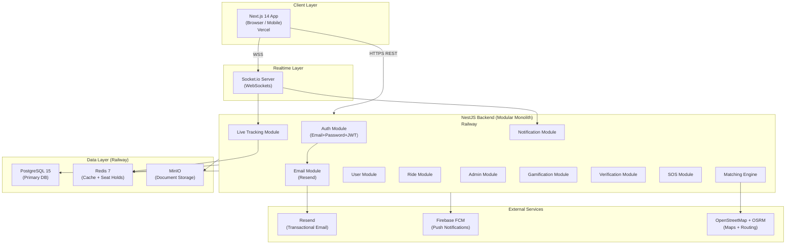
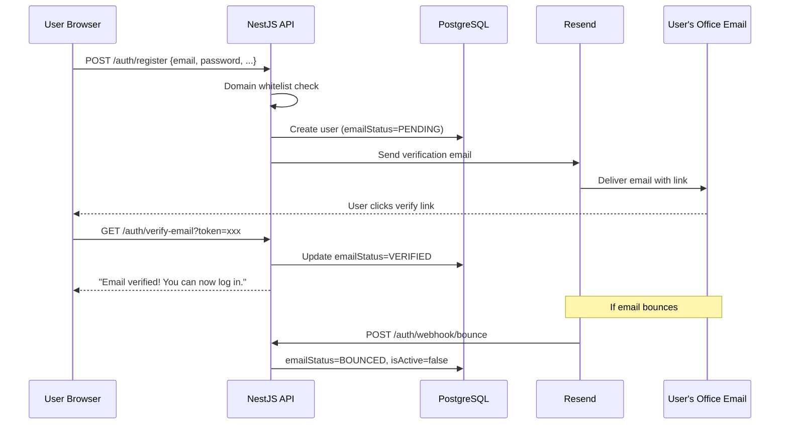
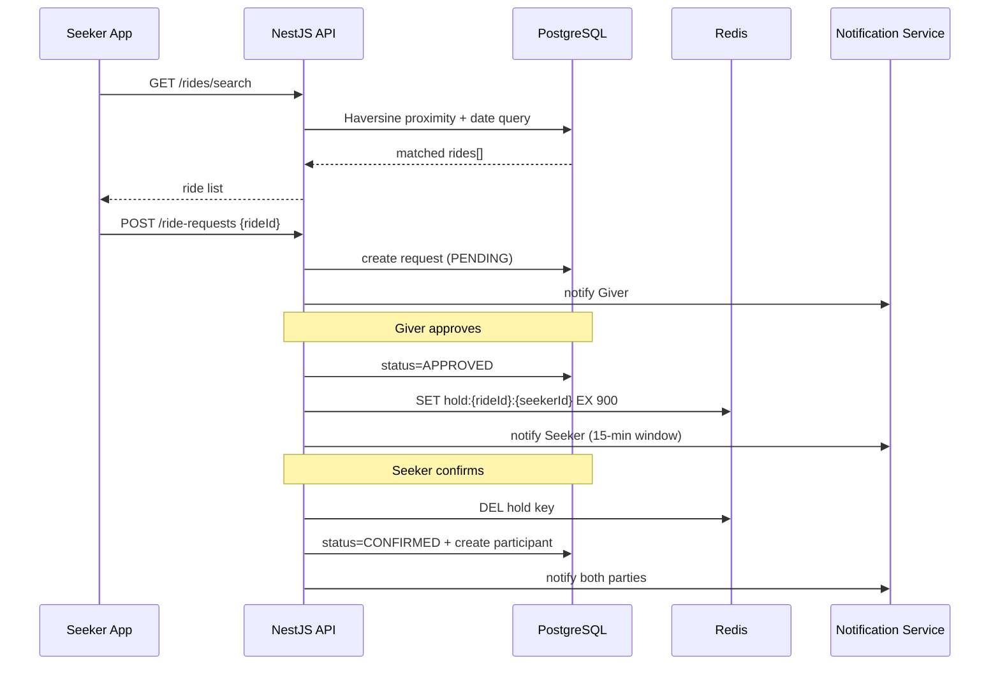

# System Architecture — TechieRide WebApp v2.0_Beta

> **Version:** 2.0_Beta  
> **Last Updated:** May 2026  
> **Status:** Beta — deployed on Vercel (web) + Railway (API + DB + Redis)

---

## 1. Architecture Style

TechieRide uses a **Modular Monolith** backend architecture. All business logic is co-located in a single NestJS application, organized into cohesive modules with clear boundaries. This avoids the operational complexity of microservices at launch while maintaining clean separation of concerns that enables future extraction if needed.

---

## 2. High-Level System Architecture

---

## 3. Backend Modules (NestJS)

### 3.1 Auth Module *(Updated in v2.0_Beta)*
- **Email + Password** authentication (replaces Phone OTP)
- **IT company domain whitelist** — 70+ approved corporate domains (tcs.com, infosys.com, wipro.com, etc.)
- Personal emails (gmail, yahoo, etc.) rejected at registration with clear error
- Email verification via **Resend** — link sent on signup, must click to activate
- **Bounce handling** — Resend webhook marks bounced emails as `EMAIL_BOUNCED`, deactivates account
- JWT access token (15 min expiry) + refresh token (7 days)
- Forgot/reset password flow via secure tokenised links (1 hr expiry)
- **Suspended users blocked immediately** — JWT strategy checks `isActive` on every request
- Dev mode: email auto-verified on register (no Resend needed for local dev/CI)

### 3.2 Email Module *(New in v2.0_Beta)*
- Powered by **Resend** (3,000 free emails/month)
- Sends: verification email, welcome email, password reset email
- Falls back to console logging when `RESEND_API_KEY` not set (dev/CI)
- HTML branded emails with TechieRide logo and "for a better society..." tagline

### 3.3 User Module
- Profile CRUD
- Verification status management
- Emergency contact management
- Preference settings

### 3.4 Ride Module
- Ride CRUD (create, publish, start, complete, cancel)
- Ride request handling (request → approve → hold → confirm)
- Seat reservation with 15-min Redis TTL hold
- Ride lifecycle state machine enforcement

### 3.5 Matching Engine
- Geospatial proximity search using Haversine formula
- Time window overlap calculation
- Returns ranked match list for Seeker

### 3.6 Commute Template Module
- Template creation (recurring route + schedule)
- Cron-based daily ride auto-publish (NestJS Scheduler)
- Template pause / resume

### 3.7 Live Tracking Module
- Receives GPS pings from Giver's browser (WebSocket)
- Stores last-known location in Redis (TTL: 24h)
- Broadcasts to Seeker's WebSocket room

### 3.8 Notification Module
- In-app notifications (stored in DB)
- Push notifications via FCM
- Event-driven: ride approved, confirmed, started, completed, cancelled, SOS

### 3.9 Gamification Module
- ECO point calculation on ride completion
- CO2 savings computation
- Level assignment (SEED → SPROUT → LEAF → TREE → FOREST)
- Leaderboard aggregation (cached in Redis, refreshed hourly)

### 3.10 Verification Module
- Document upload → MinIO storage
- Admin review queue
- Status: PENDING → APPROVED / REJECTED

### 3.11 SOS Module *(Added in v2.0_Beta)*
- `POST /sos` — authenticated user triggers SOS with lat/lng
- Notifies all admins instantly
- Admin can acknowledge and resolve with notes
- `GET /admin/sos/active` — admin dashboard shows active alerts

### 3.12 Admin Module
- User management (list, view, suspend, activate)
- Verification review queue
- Ride oversight
- SOS response dashboard
- Platform analytics

---

## 4. Frontend (Next.js 14)

- **App Router** with client components for interactive pages
- **Leaflet.js** for OpenStreetMap tile rendering
- **Socket.io client** for real-time tracking and notifications
- **Zustand** for global auth state (persisted in localStorage)
- **Axios** with JWT interceptor (auto-refresh on 401, skip for /auth/ endpoints)
- **Responsive** — desktop sidebar nav + mobile bottom nav (`sm:hidden`)
- **Branding** — TechieRide logo, v2.0_Beta badge, "for a better society..." tagline

---

## 5. Database (PostgreSQL 15)

- Primary relational store for all domain data
- Haversine formula for geospatial ride matching
- Connection pooling via PgBouncer (production)
- Hosted on Railway (beta)

---

## 6. Cache Layer (Redis 7)

| Use Case | Key Pattern | TTL |
|---|---|---|
| Seat hold reservation | `hold:{rideId}:{seekerId}` | 15 min |
| Live GPS position | `gps:{rideId}` | 24 h |
| Leaderboard | `leaderboard:monthly` | 1 h |
| Rate limiting | `ratelimit:{ip}` | 1 min |

> **Removed in v2.0_Beta:** OTP store (`otp:{phone}`) — replaced by email+password auth

---

## 7. File Storage (MinIO)

| Bucket | Contents |
|---|---|
| `user-documents` | Employee ID, driving license, RC uploads |
| `profile-photos` | User profile images |

All buckets are private. Pre-signed URLs (15-min expiry) used for serving documents.

---

## 8. Maps (OpenStreetMap + OSRM)

- **Leaflet.js** renders tile maps (OSM tiles, free, no API key)
- **Haversine formula** in PostgreSQL for proximity matching
- Route polylines stored as GeoJSON in rides table

---

## 9. Realtime (WebSockets)

- **Socket.io** embedded in NestJS via `@nestjs/websockets`
- Rooms: `ride:{rideId}` — all participants share a room
- Events: `gps:update`, `ride:status`, `notification:new`, `sos:alert`

---

## 10. Data Flow — Email Verification *(New in v2.0_Beta)*

---

## 11. Data Flow — Ride Request

---

## 12. Infrastructure — v2.0_Beta Deployment

| Layer | Service | Plan | Cost |
|---|---|---|---|
| Web (Next.js) | Vercel | Hobby | Free |
| API (NestJS) | Railway | Starter | ~$5/month free credit |
| Database | Railway PostgreSQL | Starter | Included |
| Cache | Railway Redis | Starter | Included |
| Email | Resend | Free | 3,000/month free |
| CI/CD | GitHub Actions | Free (public repo) | Free |
| Domain | — | Custom when ready | ~₹800/year |

---

## 13. External Integrations

| Service | Provider | Purpose | Status |
|---|---|---|---|
| Transactional Email | Resend | Verification, reset, welcome | ✅ Integrated |
| Push Notifications | Firebase FCM | Mobile + browser push | 🔧 Config pending |
| Maps | OpenStreetMap (Leaflet) | Tile rendering | ✅ Live |
| Routing | OSRM (self-hosted) | Route + ETA | 🔧 Future |
| File Storage | MinIO | Documents + photos | ✅ Integrated |
| SMS | — | Replaced by email auth | ❌ Removed |
