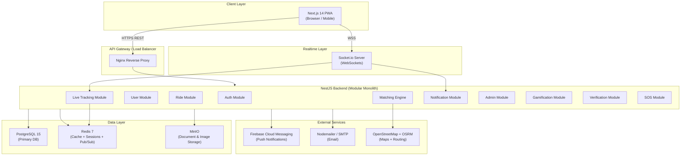
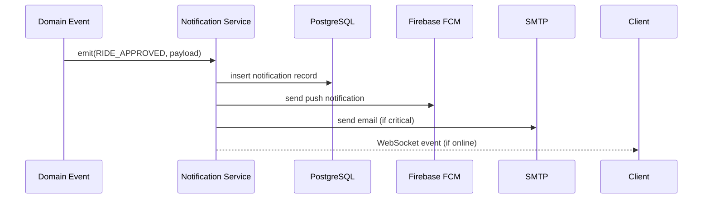
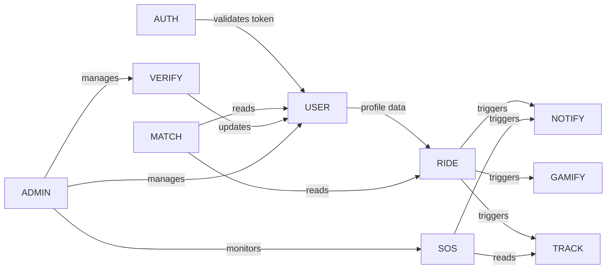
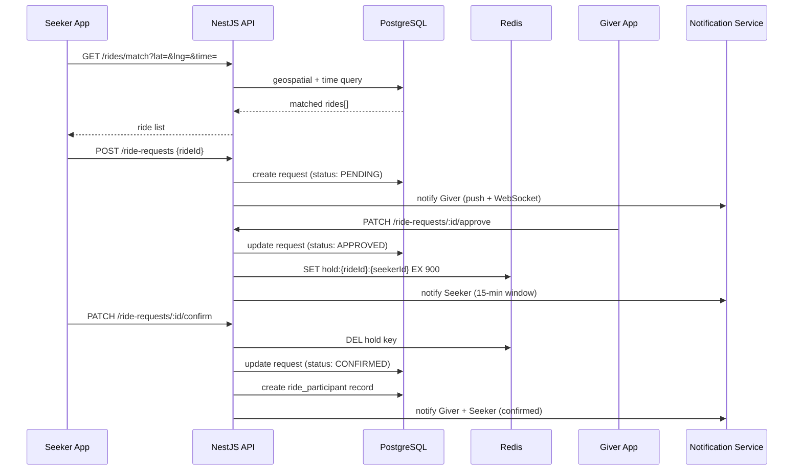

# System Architecture — Techie Ride WebApp V2

## 1. Architecture Style

Techie Ride uses a **Modular Monolith** backend architecture. All business logic is co-located in a single NestJS application, organized into cohesive modules with clear boundaries. This avoids the operational complexity of microservices at launch while maintaining a clean separation of concerns that enables future extraction if needed.

---

## 2. High-Level System Architecture

---

## 3. Backend Services (NestJS Modules)

### 3.1 Auth Module
- JWT access token (15 min expiry) + refresh token (7 days)
- Phone OTP via SMS gateway
- Work email domain validation on registration
- Token blacklist via Redis on logout

### 3.2 User Module
- Profile CRUD
- Verification status management
- Preference settings (gender preference for ride matching, etc.)
- Emergency contact management

### 3.3 Ride Module
- Ride CRUD (create, publish, cancel)
- Ride request handling
- Seat reservation with 15-min Redis TTL hold
- Ride lifecycle state transitions

### 3.4 Matching Engine
- Geospatial query against published rides (PostGIS or Haversine)
- Time window overlap calculation
- Returns ranked match list for Seeker

### 3.5 Commute Template Module
- Template creation (recurring route + schedule)
- Cron-based daily ride auto-publish (NestJS Scheduler)
- Template pause / resume

### 3.6 Live Tracking Module
- Receives GPS pings from Giver's browser (WebSocket)
- Stores last-known location in Redis (TTL: 24h)
- Broadcasts to Seeker's WebSocket room
- Persists location log in PostgreSQL for audit

### 3.7 Notification Module
- In-app notifications (stored in DB)
- Push notifications via FCM
- Email notifications via Nodemailer
- Event-driven: ride approved, confirmed, started, completed, SOS

### 3.8 Gamification Module
- ECO point calculation on ride completion
- CO2 savings computation
- Level assignment logic
- Leaderboard aggregation (cached in Redis, refreshed hourly)

### 3.9 Verification Module
- Document upload → MinIO storage
- Admin review queue
- Status transitions: pending → approved / rejected
- Automated work email domain check

### 3.10 SOS Module
- SOS event creation
- Emergency contact notification (push + email + SMS)
- Admin alert
- Location snapshot at SOS trigger time

### 3.11 Admin Module
- User management (list, view, suspend, ban)
- Verification review queue
- Ride oversight
- SOS response dashboard
- Platform analytics (aggregated, no PII exposure)

---

## 4. Frontend (Next.js 14)

- **App Router** with server components for SEO-sensitive pages
- **Client components** for interactive ride maps and live tracking
- **Leaflet.js** for OpenStreetMap rendering
- **Socket.io client** for real-time tracking and notifications
- **PWA** configuration for mobile add-to-homescreen
- **Axios** for REST API calls with JWT interceptor

---

## 5. Database (PostgreSQL 15)

- Primary relational store for all domain data
- **PostGIS extension** for geospatial ride matching (proximity queries)
- Connection pooling via **PgBouncer**
- Daily backups via pg_dump to MinIO

---

## 6. Cache Layer (Redis 7)

| Use Case | Key Pattern | TTL |
|----------|-------------|-----|
| Session / JWT blacklist | `blacklist:{jid}` | Token expiry |
| OTP store | `otp:{phone}` | 5 min |
| Seat hold reservation | `hold:{rideId}:{seekerId}` | 15 min |
| Live GPS position | `gps:{rideId}` | 24 h |
| Leaderboard | `leaderboard:monthly` | 1 h |
| Rate limiting | `ratelimit:{ip}` | 1 min |

---

## 7. File Storage (MinIO)

| Bucket | Contents |
|--------|----------|
| `user-documents` | Employee ID, driving license, RC uploads |
| `profile-photos` | User profile images |
| `ride-attachments` | Any ride-related uploads |
| `db-backups` | Nightly pg_dump archives |

All buckets are private. Pre-signed URLs (15-min expiry) are used for serving documents.

---

## 8. Maps (OpenStreetMap + OSRM)

- **Leaflet.js** renders tile maps in the browser (OSM tiles)
- **OSRM** (self-hosted) calculates route geometry and ETA
- **Haversine formula** used in PostgreSQL for proximity matching (no external API call)
- Route polylines stored as GeoJSON in the rides table

---

## 9. Realtime (WebSockets)

- **Socket.io** server embedded in NestJS via `@nestjs/websockets`
- Rooms: `ride:{rideId}` — all participants of a ride share a room
- Events:
  - `gps:update` — Giver pushes GPS, server broadcasts to room
  - `ride:status` — state change events
  - `notification:new` — in-app notification delivery
  - `sos:alert` — SOS broadcast to admin room

---

## 10. Notification System

---

## 11. Service Interaction Diagram

---

## 12. Data Flow — Ride Request

---

## 13. External Integrations

| Service | Provider | Purpose |
|---------|----------|---------|
| Push Notifications | Firebase FCM | Mobile + browser push |
| Email | Nodemailer + SMTP | Transactional emails |
| Maps | OpenStreetMap (Leaflet) | Tile rendering |
| Routing | OSRM (self-hosted) | Route + ETA |
| SMS OTP | MSG91 / Twilio | Phone verification |
