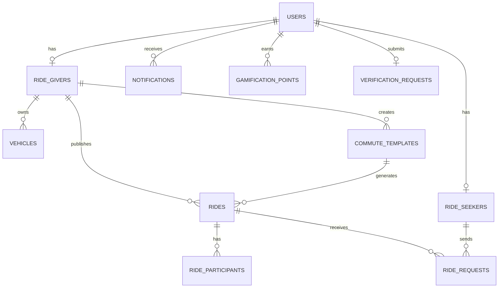

# Database Design — TechieRide WebApp v2.0_Beta

> **Version:** 2.0_Beta | **Last Updated:** May 2026

**Database:** PostgreSQL 15  
**ORM:** Prisma 5  
**Connection Pooler:** PgBouncer (production)  
**Hosted:** Railway (beta)

---

## 1. Entity Relationship Overview



---

## 2. Table Definitions

### 2.1 users *(Updated in v2.0_Beta)*

> **Changes from v1:** `phone` is now optional, `password_hash` added, OTP table removed,
> `email_status` enum added, verification token fields added.

```sql
CREATE TABLE users (
    id                          UUID PRIMARY KEY DEFAULT gen_random_uuid(),
    email                       VARCHAR(255) UNIQUE NOT NULL,   -- office email (domain whitelist enforced)
    password_hash               VARCHAR(255) NOT NULL,          -- bcrypt, 12 rounds
    full_name                   VARCHAR(100) NOT NULL,
    profile_photo               TEXT,
    gender                      VARCHAR(10) CHECK (gender IN ('MALE','FEMALE','OTHER')),
    company_name                VARCHAR(100),
    phone                       VARCHAR(15) UNIQUE,             -- optional (was required in v1)
    role                        VARCHAR(20) NOT NULL DEFAULT 'RIDE_SEEKER'
                                    CHECK (role IN ('RIDE_GIVER','RIDE_SEEKER','BOTH','ADMIN')),
    verification_status         VARCHAR(20) NOT NULL DEFAULT 'PENDING'
                                    CHECK (verification_status IN ('PENDING','APPROVED','REJECTED')),
    email_status                VARCHAR(20) NOT NULL DEFAULT 'PENDING'
                                    CHECK (email_status IN ('PENDING','VERIFIED','BOUNCED')),
    email_verification_token    VARCHAR(255) UNIQUE,            -- hex token, expires in 24h
    email_verification_expiry   TIMESTAMP WITH TIME ZONE,
    password_reset_token        VARCHAR(255) UNIQUE,            -- hex token, expires in 1h
    password_reset_expiry       TIMESTAMP WITH TIME ZONE,
    is_active                   BOOLEAN NOT NULL DEFAULT TRUE,
    fcm_token                   TEXT,
    eco_points                  INTEGER NOT NULL DEFAULT 0,
    eco_level                   VARCHAR(20) NOT NULL DEFAULT 'SEED'
                                    CHECK (eco_level IN ('SEED','SPROUT','LEAF','TREE','FOREST')),
    created_at                  TIMESTAMP WITH TIME ZONE DEFAULT NOW(),
    updated_at                  TIMESTAMP WITH TIME ZONE DEFAULT NOW()
);

CREATE INDEX idx_users_email ON users(email);
CREATE INDEX idx_users_email_status ON users(email_status);
CREATE INDEX idx_users_verification_status ON users(verification_status);
```

**Email status values:**
| Status | Meaning |
|---|---|
| `PENDING` | Registered, verification email sent, not yet clicked |
| `VERIFIED` | User clicked verification link — can log in |
| `BOUNCED` | Resend bounce webhook fired — email undeliverable, account deactivated |

---

### 2.2 verification_requests

```sql
CREATE TABLE verification_requests (
    id                  UUID PRIMARY KEY DEFAULT gen_random_uuid(),
    user_id             UUID NOT NULL REFERENCES users(id) ON DELETE CASCADE,
    employee_id_url     TEXT,
    driving_license_url TEXT,
    rc_url              TEXT,
    status              VARCHAR(20) NOT NULL DEFAULT 'PENDING'
                            CHECK (status IN ('PENDING','APPROVED','REJECTED')),
    rejection_reason    TEXT,
    reviewed_by         UUID REFERENCES users(id),  -- admin user
    reviewed_at         TIMESTAMP WITH TIME ZONE,
    submitted_at        TIMESTAMP WITH TIME ZONE DEFAULT NOW(),
    updated_at          TIMESTAMP WITH TIME ZONE DEFAULT NOW()
);

CREATE INDEX idx_verif_user ON verification_requests(user_id);
CREATE INDEX idx_verif_status ON verification_requests(status);
```

---

### 2.3 vehicles

```sql
CREATE TABLE vehicles (
    id              UUID PRIMARY KEY DEFAULT gen_random_uuid(),
    ride_giver_id   UUID NOT NULL REFERENCES ride_givers(id) ON DELETE CASCADE,
    make            VARCHAR(50) NOT NULL,
    model           VARCHAR(50) NOT NULL,
    year            SMALLINT,
    color           VARCHAR(30),
    plate_number    VARCHAR(20) UNIQUE NOT NULL,
    rc_url          TEXT,
    rc_verified     BOOLEAN NOT NULL DEFAULT FALSE,
    total_seats     SMALLINT NOT NULL CHECK (total_seats BETWEEN 1 AND 7),
    is_active       BOOLEAN NOT NULL DEFAULT TRUE,
    created_at      TIMESTAMP WITH TIME ZONE DEFAULT NOW()
);
```

---

### 2.4 ride_givers

```sql
CREATE TABLE ride_givers (
    id                  UUID PRIMARY KEY DEFAULT gen_random_uuid(),
    user_id             UUID UNIQUE NOT NULL REFERENCES users(id) ON DELETE CASCADE,
    driving_license_url TEXT,
    license_verified    BOOLEAN NOT NULL DEFAULT FALSE,
    total_rides_given   INTEGER NOT NULL DEFAULT 0,
    average_rating      DECIMAL(3,2) DEFAULT 0.00,
    preferred_gender    VARCHAR(15) DEFAULT 'ANY'
                            CHECK (preferred_gender IN ('ANY','FEMALE_ONLY','MALE_ONLY')),
    is_available        BOOLEAN NOT NULL DEFAULT TRUE,
    created_at          TIMESTAMP WITH TIME ZONE DEFAULT NOW()
);
```

---

### 2.5 ride_seekers

```sql
CREATE TABLE ride_seekers (
    id                  UUID PRIMARY KEY DEFAULT gen_random_uuid(),
    user_id             UUID UNIQUE NOT NULL REFERENCES users(id) ON DELETE CASCADE,
    total_rides_taken   INTEGER NOT NULL DEFAULT 0,
    average_rating      DECIMAL(3,2) DEFAULT 0.00,
    preferred_gender    VARCHAR(15) DEFAULT 'ANY'
                            CHECK (preferred_gender IN ('ANY','FEMALE_ONLY','MALE_ONLY')),
    created_at          TIMESTAMP WITH TIME ZONE DEFAULT NOW()
);
```

---

### 2.6 commute_templates

```sql
CREATE TABLE commute_templates (
    id                  UUID PRIMARY KEY DEFAULT gen_random_uuid(),
    ride_giver_id       UUID NOT NULL REFERENCES ride_givers(id) ON DELETE CASCADE,
    vehicle_id          UUID NOT NULL REFERENCES vehicles(id),
    origin_name         VARCHAR(200) NOT NULL,
    origin_lat          DECIMAL(10,7) NOT NULL,
    origin_lng          DECIMAL(10,7) NOT NULL,
    destination_name    VARCHAR(200) NOT NULL,
    destination_lat     DECIMAL(10,7) NOT NULL,
    destination_lng     DECIMAL(10,7) NOT NULL,
    departure_days      SMALLINT[] NOT NULL,  -- [1,2,3,4,5] = Mon-Fri
    departure_time      TIME NOT NULL,
    total_seats         SMALLINT NOT NULL,
    is_active           BOOLEAN NOT NULL DEFAULT TRUE,
    last_published_date DATE,
    created_at          TIMESTAMP WITH TIME ZONE DEFAULT NOW(),
    updated_at          TIMESTAMP WITH TIME ZONE DEFAULT NOW()
);

CREATE INDEX idx_templates_giver ON commute_templates(ride_giver_id);
CREATE INDEX idx_templates_active ON commute_templates(is_active);
```

---

### 2.7 rides

```sql
CREATE TABLE rides (
    id                      UUID PRIMARY KEY DEFAULT gen_random_uuid(),
    ride_giver_id           UUID NOT NULL REFERENCES ride_givers(id),
    vehicle_id              UUID NOT NULL REFERENCES vehicles(id),
    template_id             UUID REFERENCES commute_templates(id),
    origin_name             VARCHAR(200) NOT NULL,
    origin_lat              DECIMAL(10,7) NOT NULL,
    origin_lng              DECIMAL(10,7) NOT NULL,
    destination_name        VARCHAR(200) NOT NULL,
    destination_lat         DECIMAL(10,7) NOT NULL,
    destination_lng         DECIMAL(10,7) NOT NULL,
    route_polyline          JSONB,
    estimated_distance_km   DECIMAL(6,2),
    estimated_duration_min  INTEGER,
    departure_date          DATE NOT NULL,
    departure_time          TIME NOT NULL,
    estimated_arrival_time  TIME,
    total_seats             SMALLINT NOT NULL,
    available_seats         SMALLINT NOT NULL,
    status                  VARCHAR(20) NOT NULL DEFAULT 'DRAFT'
                                CHECK (status IN ('DRAFT','PUBLISHED','ONGOING','COMPLETED','CANCELLED')),
    notes                   TEXT,
    started_at              TIMESTAMP WITH TIME ZONE,
    completed_at            TIMESTAMP WITH TIME ZONE,
    cancelled_at            TIMESTAMP WITH TIME ZONE,
    cancel_reason           TEXT,
    created_at              TIMESTAMP WITH TIME ZONE DEFAULT NOW(),
    updated_at              TIMESTAMP WITH TIME ZONE DEFAULT NOW()
);

CREATE INDEX idx_rides_giver ON rides(ride_giver_id);
CREATE INDEX idx_rides_status ON rides(status);
CREATE INDEX idx_rides_date ON rides(departure_date);
CREATE INDEX idx_rides_origin ON rides(origin_lat, origin_lng);
CREATE INDEX idx_rides_destination ON rides(destination_lat, destination_lng);
```

---

### 2.8 ride_requests

```sql
CREATE TABLE ride_requests (
    id              UUID PRIMARY KEY DEFAULT gen_random_uuid(),
    ride_id         UUID NOT NULL REFERENCES rides(id) ON DELETE CASCADE,
    seeker_id       UUID NOT NULL REFERENCES ride_seekers(id),
    pickup_lat      DECIMAL(10,7),
    pickup_lng      DECIMAL(10,7),
    pickup_name     VARCHAR(200),
    drop_lat        DECIMAL(10,7),
    drop_lng        DECIMAL(10,7),
    drop_name       VARCHAR(200),
    status          VARCHAR(20) NOT NULL DEFAULT 'PENDING'
                        CHECK (status IN (
                            'PENDING','APPROVED','REJECTED',
                            'HOLD','CONFIRMED','CANCELLED','NO_SHOW'
                        )),
    hold_expires_at TIMESTAMP WITH TIME ZONE,
    confirmed_at    TIMESTAMP WITH TIME ZONE,
    cancelled_at    TIMESTAMP WITH TIME ZONE,
    cancel_reason   TEXT,
    created_at      TIMESTAMP WITH TIME ZONE DEFAULT NOW(),
    updated_at      TIMESTAMP WITH TIME ZONE DEFAULT NOW(),
    UNIQUE(ride_id, seeker_id)
);

CREATE INDEX idx_requests_ride ON ride_requests(ride_id);
CREATE INDEX idx_requests_seeker ON ride_requests(seeker_id);
CREATE INDEX idx_requests_status ON ride_requests(status);
```

---

### 2.9 ride_participants

```sql
CREATE TABLE ride_participants (
    id          UUID PRIMARY KEY DEFAULT gen_random_uuid(),
    ride_id     UUID NOT NULL REFERENCES rides(id) ON DELETE CASCADE,
    seeker_id   UUID NOT NULL REFERENCES ride_seekers(id),
    request_id  UUID NOT NULL REFERENCES ride_requests(id),
    pickup_name VARCHAR(200),
    drop_name   VARCHAR(200),
    boarded_at  TIMESTAMP WITH TIME ZONE,
    alighted_at TIMESTAMP WITH TIME ZONE,
    created_at  TIMESTAMP WITH TIME ZONE DEFAULT NOW(),
    UNIQUE(ride_id, seeker_id)
);
```

---

### 2.10 notifications

```sql
CREATE TABLE notifications (
    id          UUID PRIMARY KEY DEFAULT gen_random_uuid(),
    user_id     UUID NOT NULL REFERENCES users(id) ON DELETE CASCADE,
    type        VARCHAR(50) NOT NULL,
    title       VARCHAR(200) NOT NULL,
    body        TEXT NOT NULL,
    data        JSONB,
    is_read     BOOLEAN NOT NULL DEFAULT FALSE,
    read_at     TIMESTAMP WITH TIME ZONE,
    created_at  TIMESTAMP WITH TIME ZONE DEFAULT NOW()
);

CREATE INDEX idx_notif_user ON notifications(user_id);
CREATE INDEX idx_notif_read ON notifications(user_id, is_read);
```

---

### 2.11 gamification_points

```sql
CREATE TABLE gamification_points (
    id          UUID PRIMARY KEY DEFAULT gen_random_uuid(),
    user_id     UUID NOT NULL REFERENCES users(id) ON DELETE CASCADE,
    event_type  VARCHAR(50) NOT NULL,  -- RIDE_COMPLETED, RATING_GIVEN, STREAK_BONUS, etc.
    points      INTEGER NOT NULL,
    ride_id     UUID REFERENCES rides(id),
    co2_saved_g INTEGER DEFAULT 0,
    created_at  TIMESTAMP WITH TIME ZONE DEFAULT NOW()
);

CREATE INDEX idx_gamif_user ON gamification_points(user_id);
CREATE INDEX idx_gamif_created ON gamification_points(created_at);
```

---

### 2.12 ride_ratings

```sql
CREATE TABLE ride_ratings (
    id          UUID PRIMARY KEY DEFAULT gen_random_uuid(),
    ride_id     UUID NOT NULL REFERENCES rides(id),
    rater_id    UUID NOT NULL REFERENCES users(id),
    ratee_id    UUID NOT NULL REFERENCES users(id),
    score       SMALLINT NOT NULL CHECK (score BETWEEN 1 AND 5),
    comment     VARCHAR(200),
    created_at  TIMESTAMP WITH TIME ZONE DEFAULT NOW(),
    UNIQUE(ride_id, rater_id, ratee_id)
);
```

---

## 3. Key Constraints Summary

| Table | Constraint | Description |
|-------|-----------|-------------|
| users | UNIQUE phone | One account per phone |
| users | UNIQUE email | One account per work email |
| vehicles | UNIQUE plate_number | No duplicate plates |
| ride_requests | UNIQUE (ride_id, seeker_id) | One request per ride per seeker |
| ride_participants | UNIQUE (ride_id, seeker_id) | One seat per ride per seeker |
| ride_ratings | UNIQUE (ride_id, rater_id, ratee_id) | One rating per pair per ride |

---

## 4. Indexes Strategy

- All FK columns are indexed for JOIN performance
- `status` columns indexed for filtered queries
- `(origin_lat, origin_lng)` indexed for geospatial proximity queries
- `departure_date` indexed for date-range ride lookups
- `(user_id, is_read)` composite index for notification badge counts
