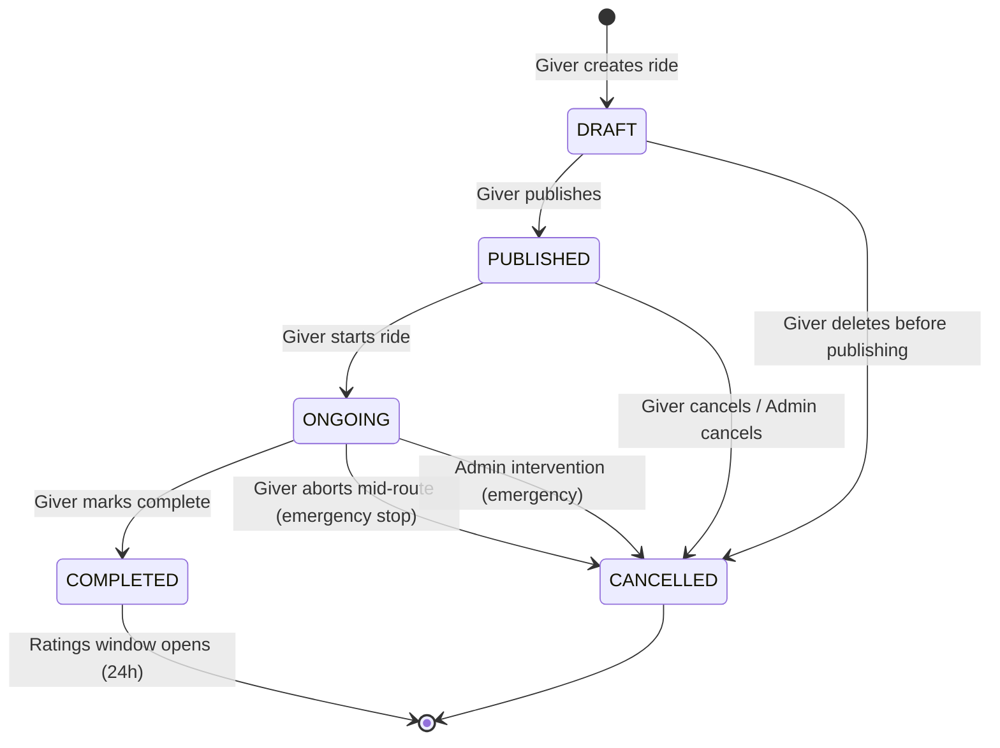
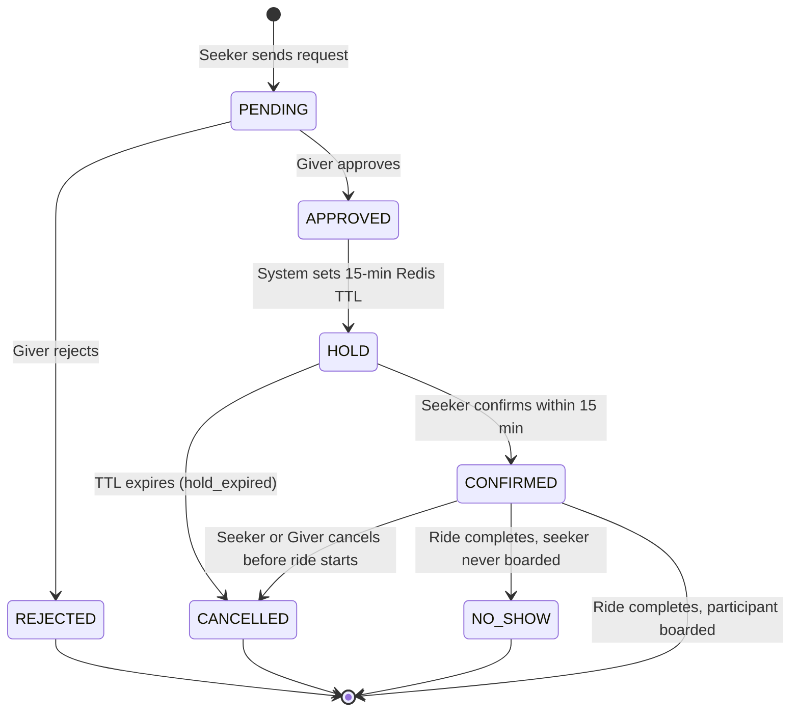
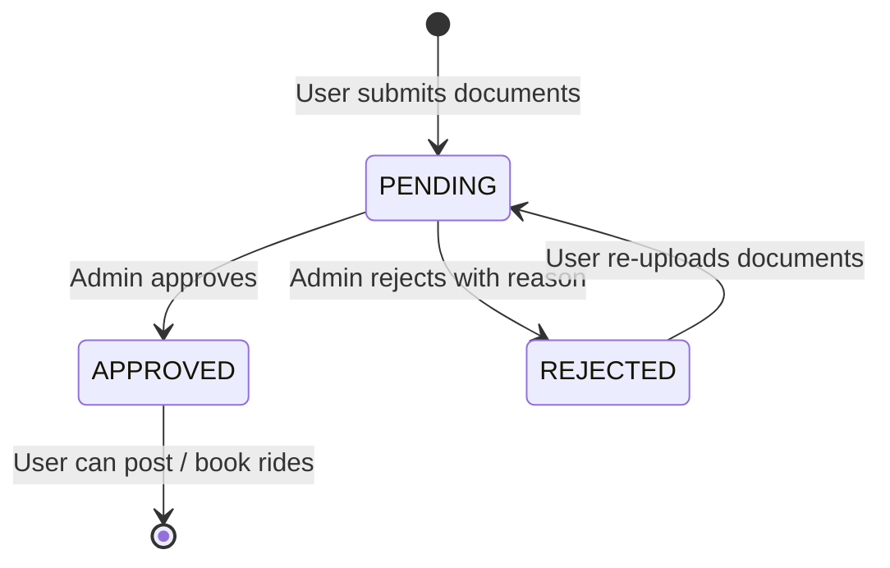
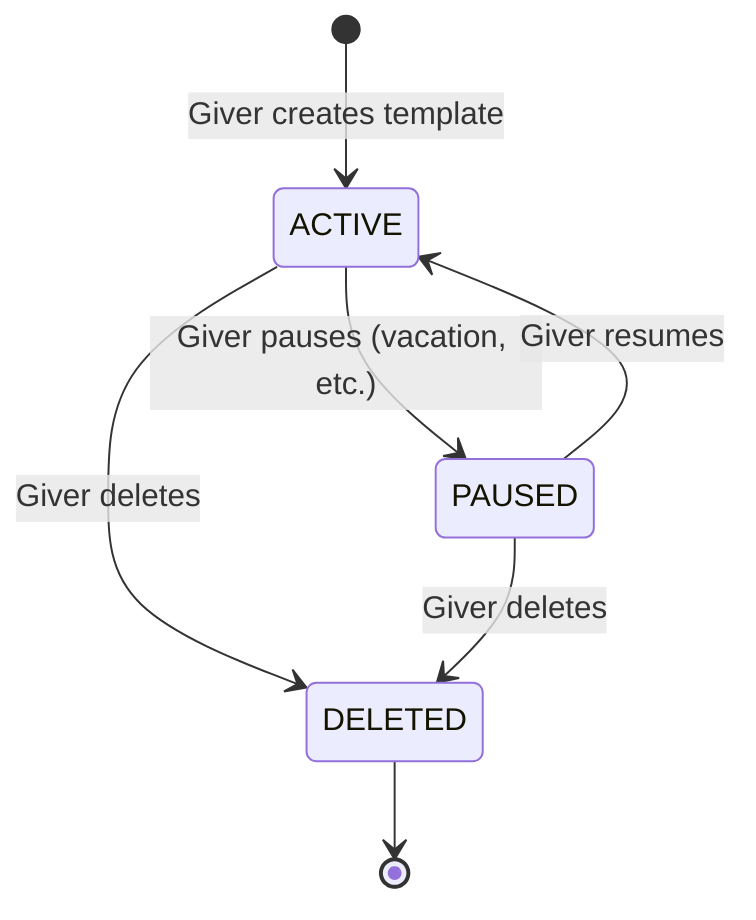
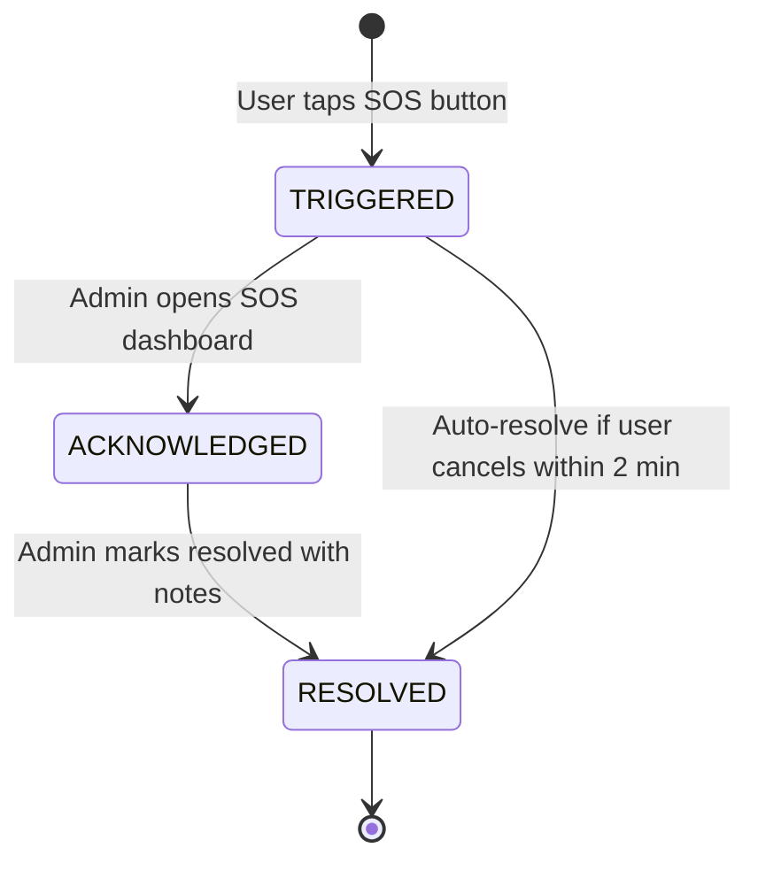
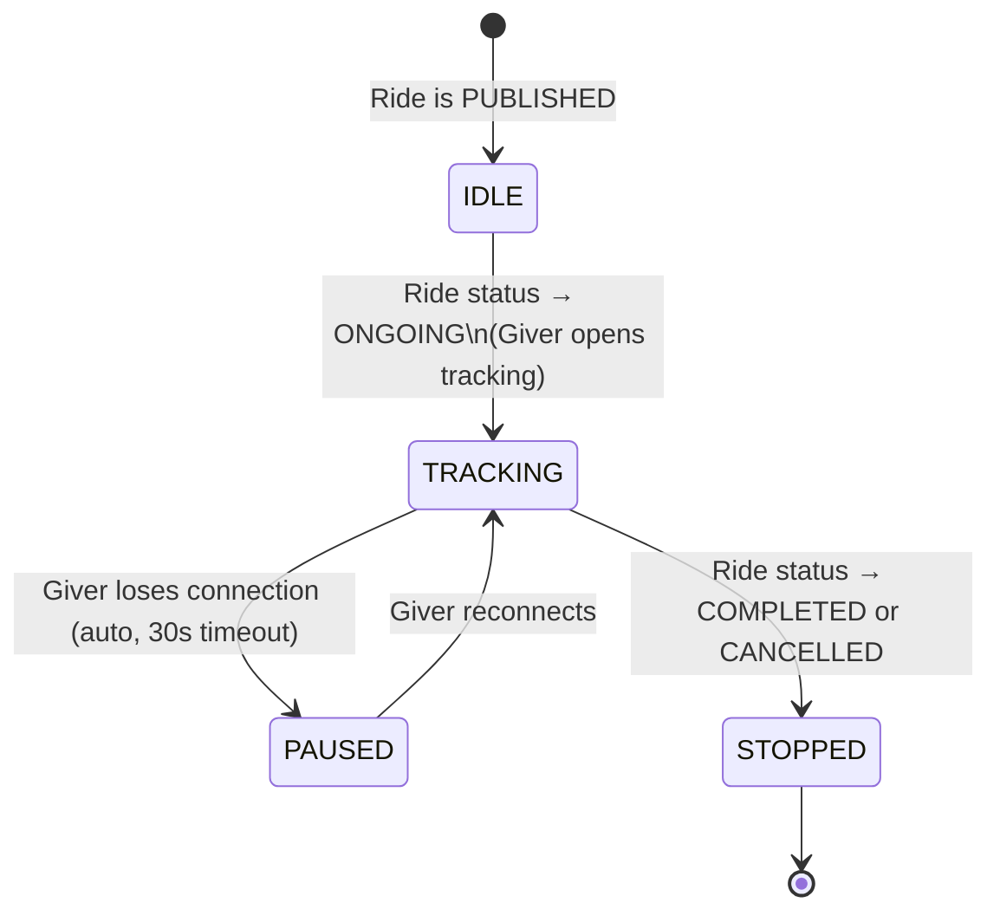

# State Machines — Techie Ride WebApp V2

---

## 1. Ride Lifecycle State Machine

### States

| State | Actor | Description |
|-------|-------|-------------|
| `DRAFT` | Giver | Ride saved, not yet visible to Seekers |
| `PUBLISHED` | Giver / System | Visible; accepting seat requests |
| `ONGOING` | Giver | Ride in progress; GPS tracking active |
| `COMPLETED` | Giver / System | All participants dropped off; ratings unlocked |
| `CANCELLED` | Giver / Admin | Ride cancelled; all bookings voided |

### Ride State Diagram

### Transition Rules

| From | To | Trigger | Guard |
|------|----|---------|-------|
| DRAFT | PUBLISHED | `PATCH /rides/:id/publish` | Giver is owner, vehicle is RC-verified |
| PUBLISHED | ONGOING | `PATCH /rides/:id/start` | At least 1 confirmed participant OR Giver override |
| PUBLISHED | CANCELLED | Giver cancels or Admin cancels | — |
| ONGOING | COMPLETED | `PATCH /rides/:id/complete` | Giver is owner |
| ONGOING | CANCELLED | Giver aborts (`PATCH /rides/:id/abort`) | Requires non-empty reason; marks all WAITING/BOARDED as NO_SHOW; trust penalty applied to Giver |
| ONGOING | CANCELLED | Admin cancels | Emergency / SOS escalation |

---

## 2. Ride Request Lifecycle State Machine

### States

| State | Description |
|-------|-------------|
| `PENDING` | Seeker sent request; awaiting Giver review |
| `APPROVED` | Giver approved; 15-min confirmation hold started |
| `HOLD` | Seat held in Redis; Seeker must confirm |
| `CONFIRMED` | Seeker confirmed; seat reserved |
| `REJECTED` | Giver rejected request |
| `CANCELLED` | Cancelled by Seeker or Giver after confirmation |
| `NO_SHOW` | Seeker confirmed but did not board |

### Request State Diagram

### Transition Rules

| From | To | Trigger | Side Effects |
|------|----|---------|--------------|
| PENDING | APPROVED | Giver approves | Redis hold set (900s), `available_seats--`, notify Seeker |
| PENDING | REJECTED | Giver rejects | Notify Seeker |
| APPROVED | HOLD | Automatic (same transition) | Hold active in Redis |
| HOLD | CONFIRMED | Seeker confirms | Redis hold deleted, `ride_participants` record created, notify both |
| HOLD | CANCELLED | Redis TTL expires | Bull job runs, `available_seats++`, notify both |
| CONFIRMED | CANCELLED | Seeker/Giver cancels | `available_seats++`, notify other party, ECO penalty if last-minute |
| CONFIRMED | NO_SHOW | Ride completed, no board event | Minor ECO point deduction for Seeker |

---

## 3. User Verification State Machine

---

## 4. Commute Template State Machine

- When `ACTIVE`: cron job includes template in daily ride auto-publish
- When `PAUSED`: template skipped by cron
- When `DELETED`: soft-delete; historical rides remain intact

---

## 5. SOS Event State Machine

| State | Description |
|-------|-------------|
| `TRIGGERED` | SOS fired; emergency contacts + admin notified |
| `ACKNOWLEDGED` | Admin has seen and is investigating |
| `RESOLVED` | Situation resolved; notes recorded |

---

## 6. Live Ride Tracking State Machine

- `TRACKING`: GPS events flowing; Redis key alive; participants receive updates
- `PAUSED`: Last known location shown; participants see "Connection lost" banner
- `STOPPED`: WebSocket room closed; Redis key TTL countdown begins (24h retention)
