# TechieRide — System Flow Diagrams

---

## 1. Signup & Email Verification Flow

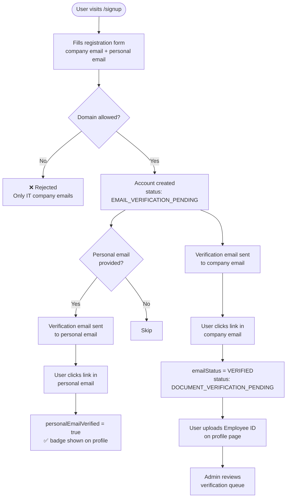

---

## 2. Admin Approval / Rejection Flow

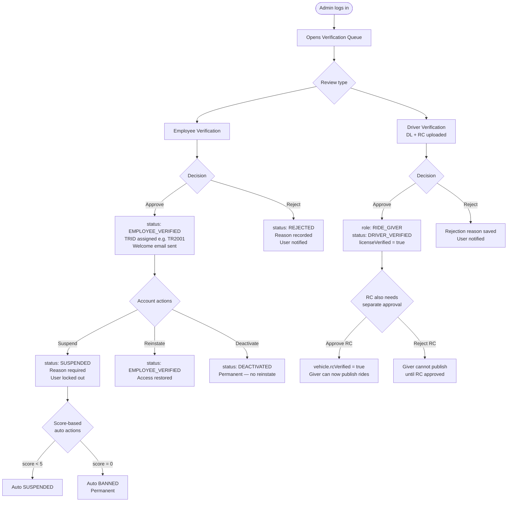

---

## 3. Ride Lifecycle Flow

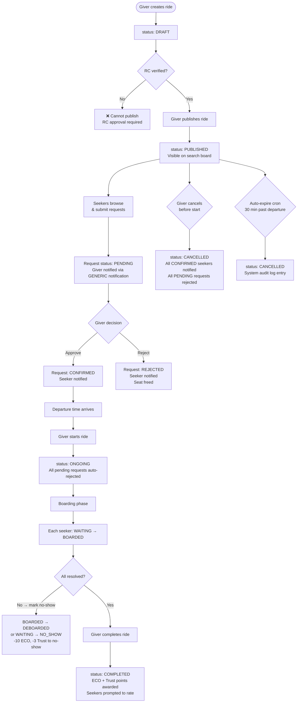

---

## 4. Seat Request Flow

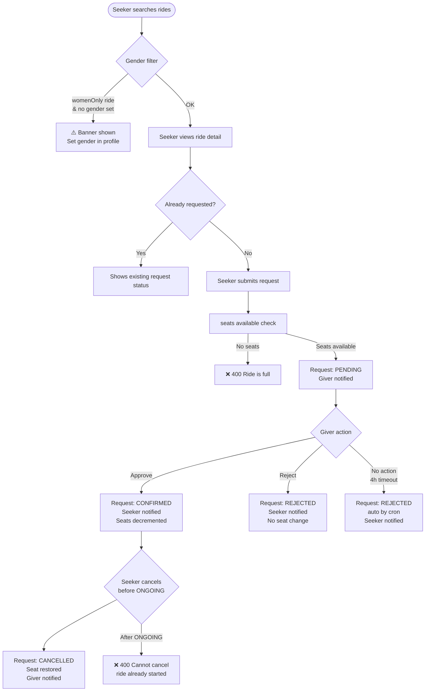

---

## 5. Trust Score & Eco Points Flow

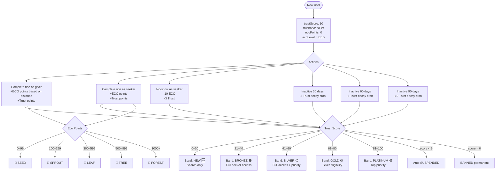

---

## 6. Verification Two-Track Flow

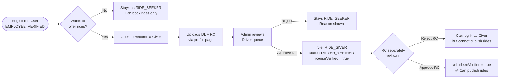

---

## 7. Boarding Flow

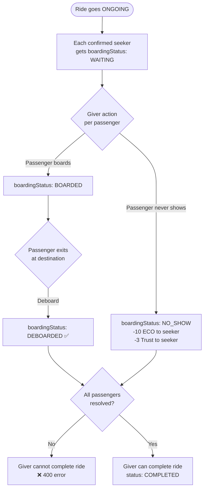

---

## 8. SOS Flow

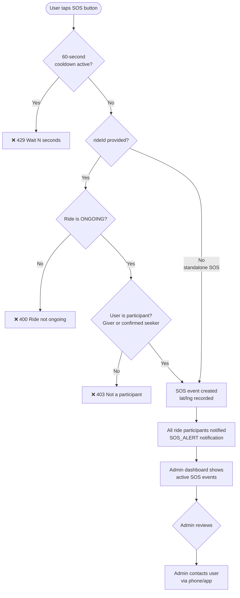

---

## 9. Complaint Flow

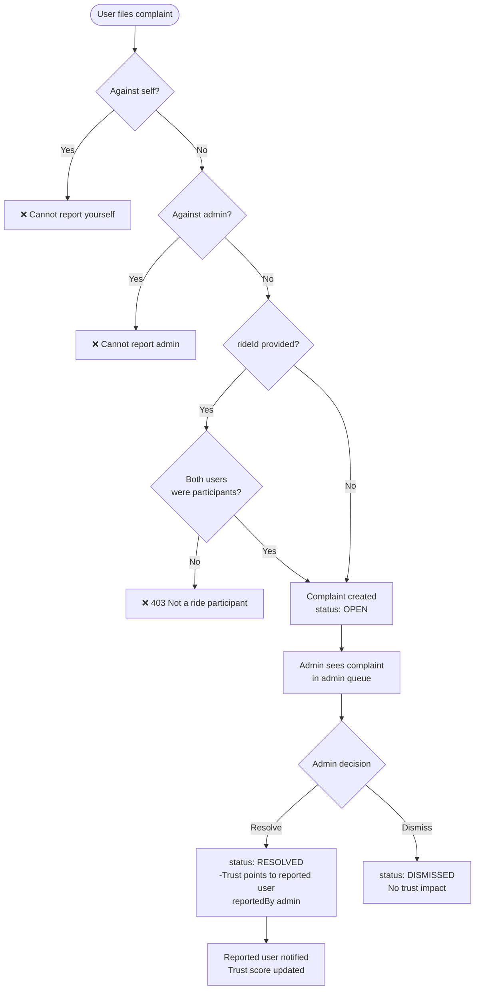

---

## 10. Rating Flow

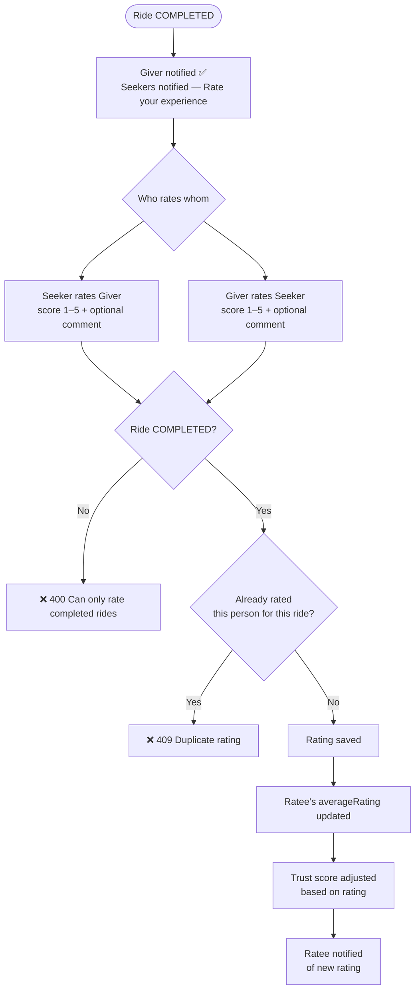

---

## 11. Password Reset Flow

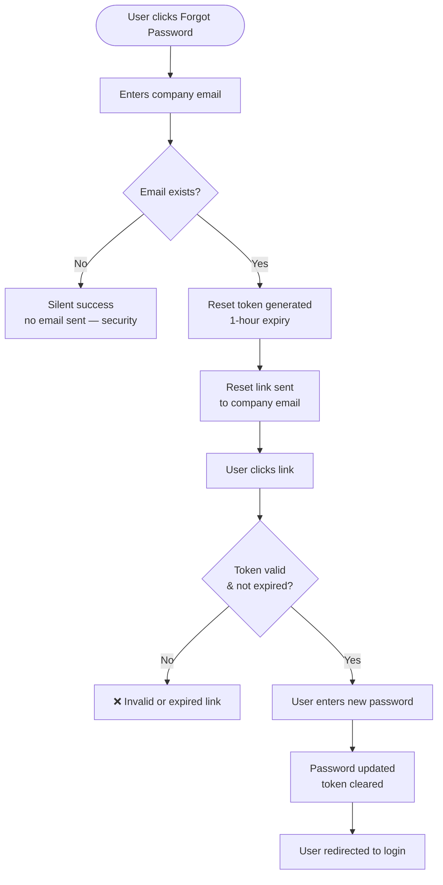

---

## 12. Official Email Change Flow

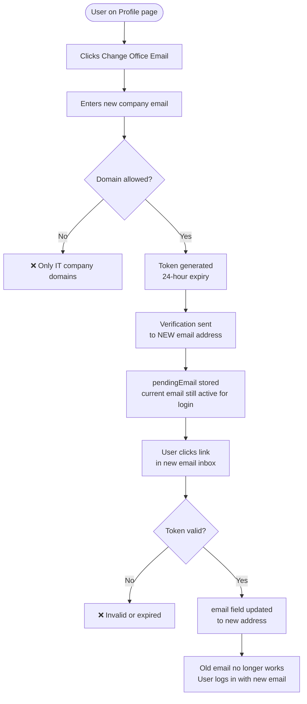

---

## 13. Commute Template Flow

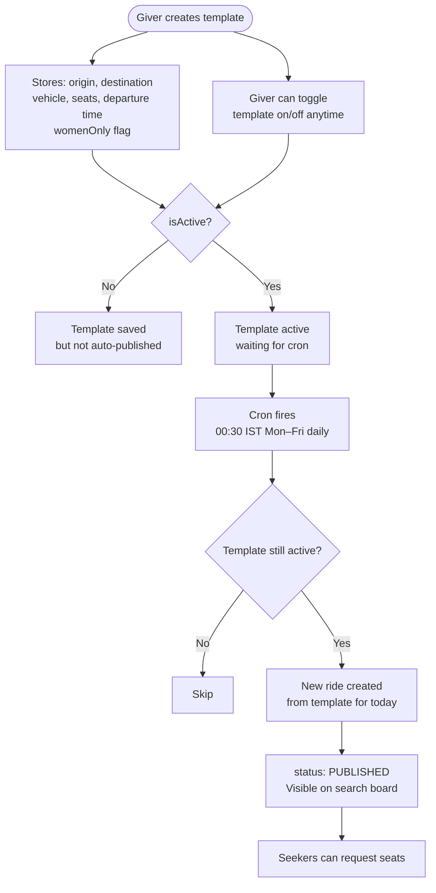

---

## 14. Cron Jobs Overview

```mermaid
flowchart LR
    subgraph Every 30 min
        A[⏱ Auto-expire unstated rides\nCancels PUBLISHED rides\n30+ min past departure\nNotifies all participants\nSystem audit log]
        B[⏱ Departure reminder\n60 min before departure\nNotifies giver + all confirmed seekers]
    end

    subgraph Every Hour
        C[⏱ Pending request expiry\nRejects PENDING requests\nolder than 4 hours\nSeeker notified]
    end

    subgraph Daily 00:30 IST Mon–Fri
        D[⏱ Commute template\nauto-publish\nCreates rides from\nactive templates]
    end

    subgraph Daily 03:00 IST
        E[⏱ Trust score decay\nInactive 30 days → -2\nInactive 60 days → -5\nInactive 90 days → -10\nFloor: 10]
    end
```

---

## 15. Notification Delivery Flow

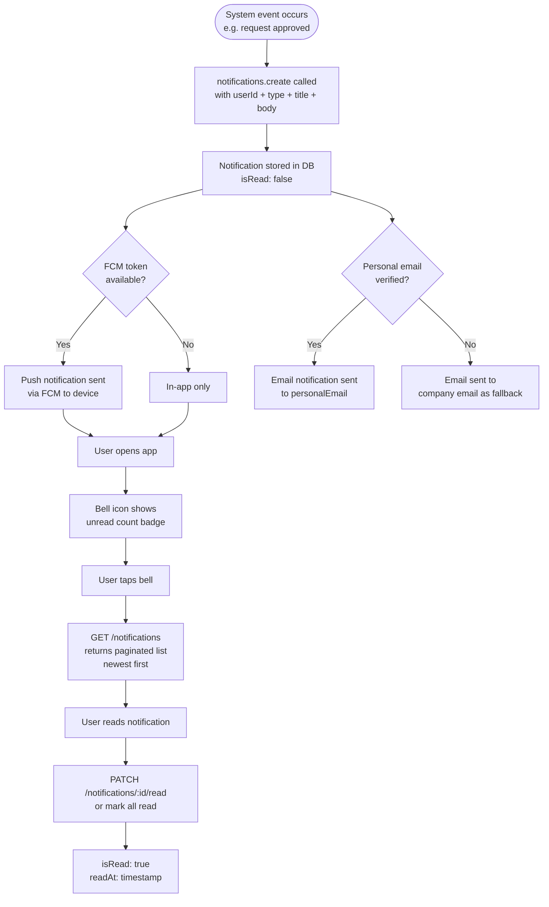

---

## 16. Live Tracking Flow

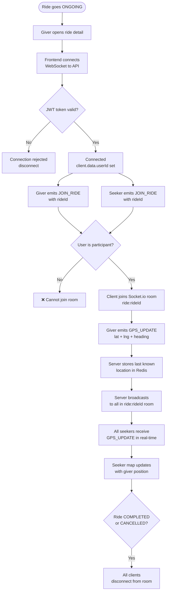

---

## 17. Upload / Document Flow

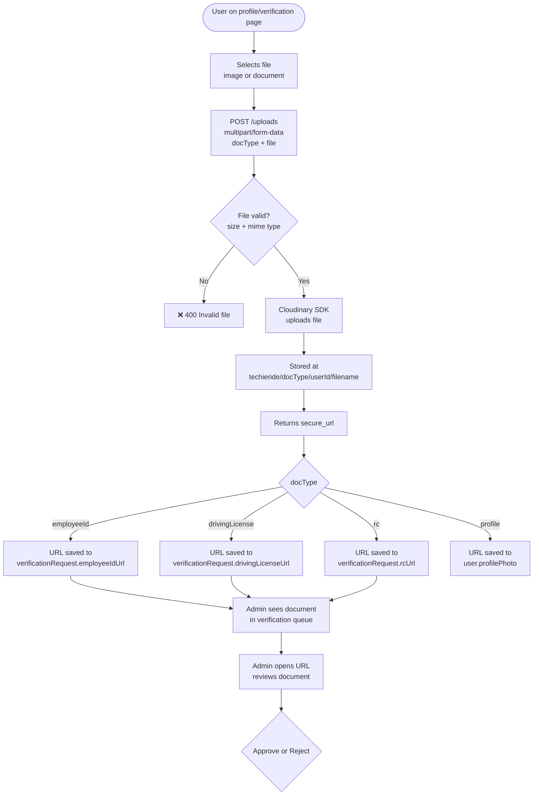
