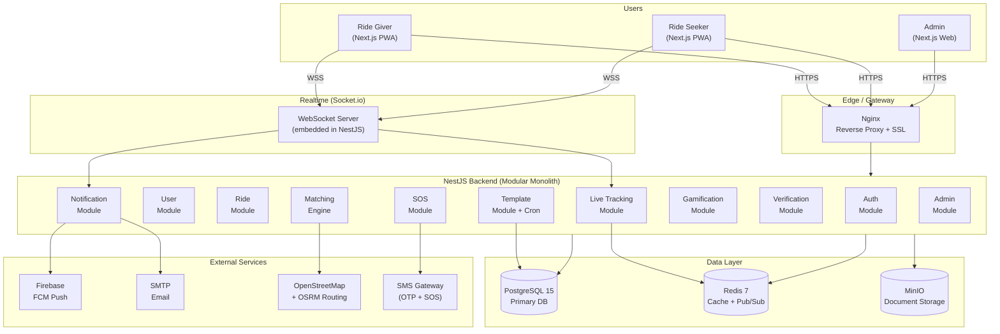
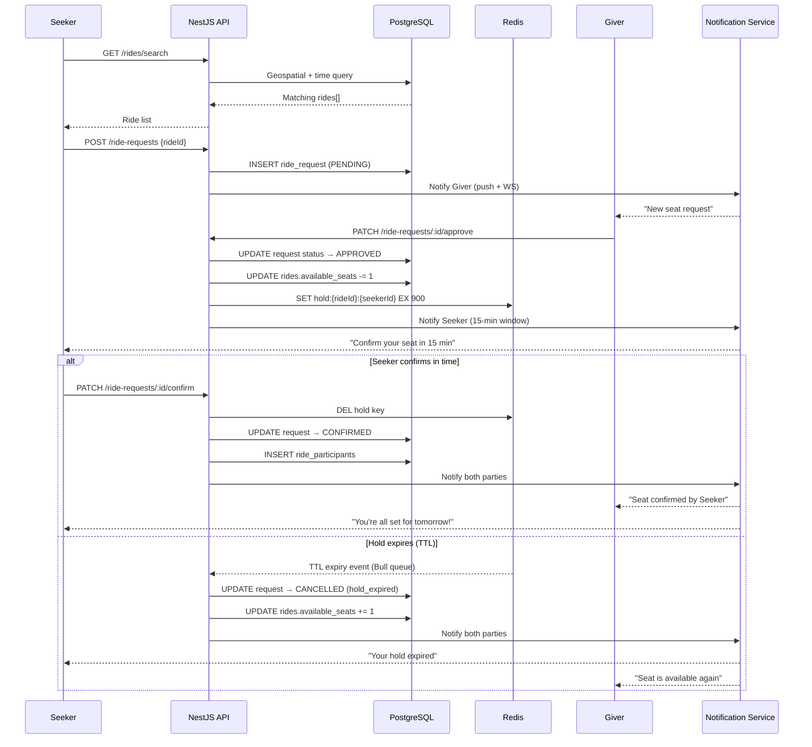
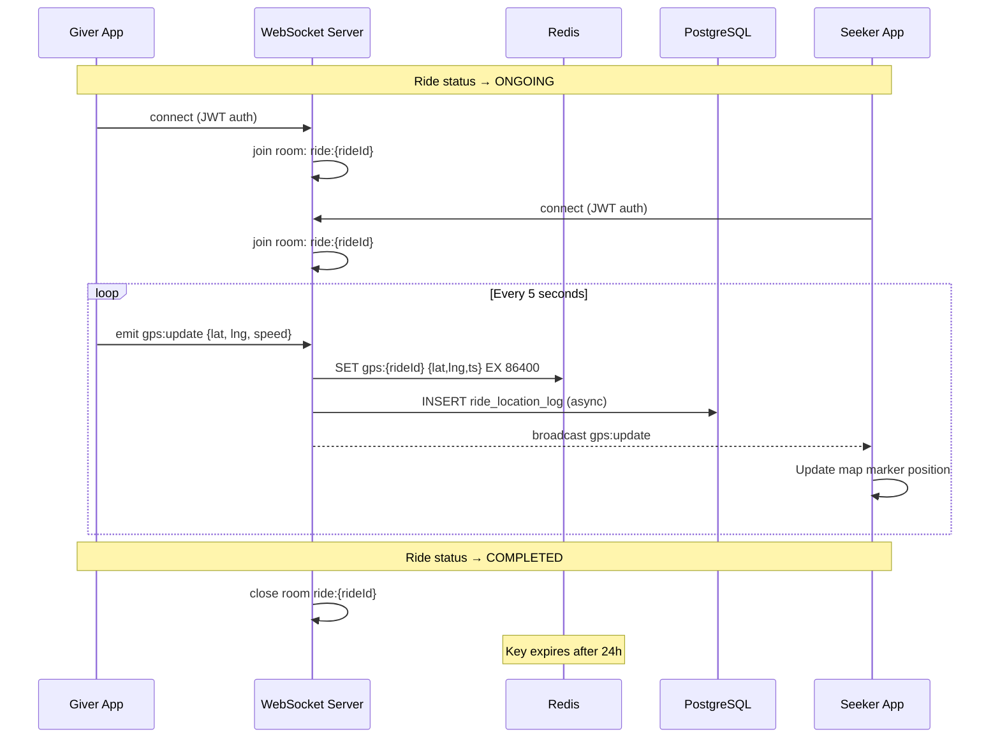
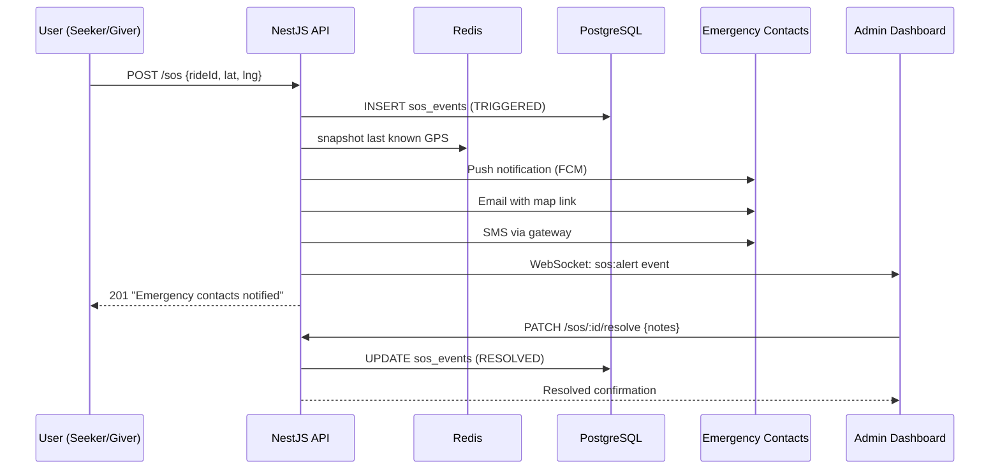
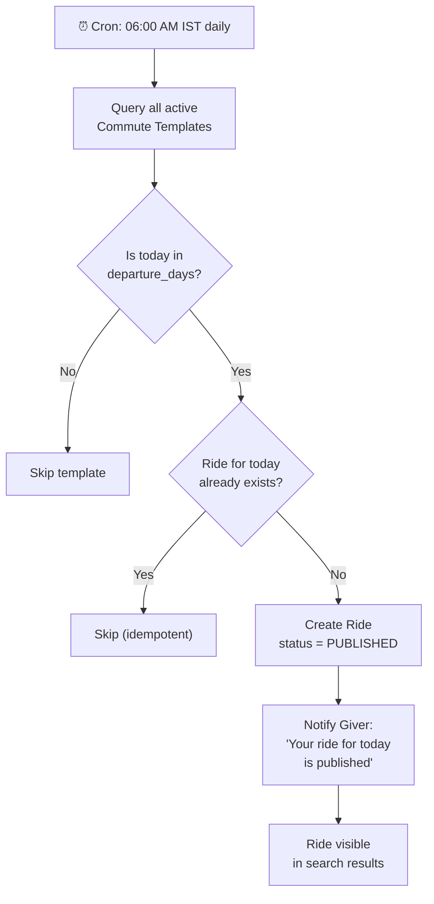
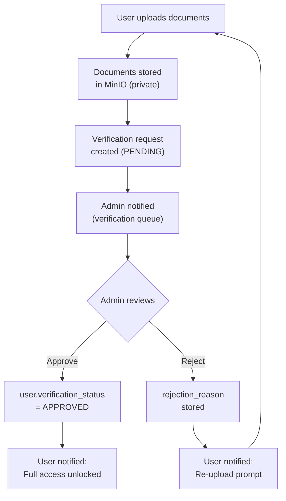

# System Diagrams — Techie Ride WebApp V2

---

## 1. Full System Architecture

---

## 2. Ride Request & Confirmation Flow

---

## 3. Live Tracking Flow

---

## 4. SOS Flow

---

## 5. Auto-Publish Cron Flow

---

## 6. Verification Flow

